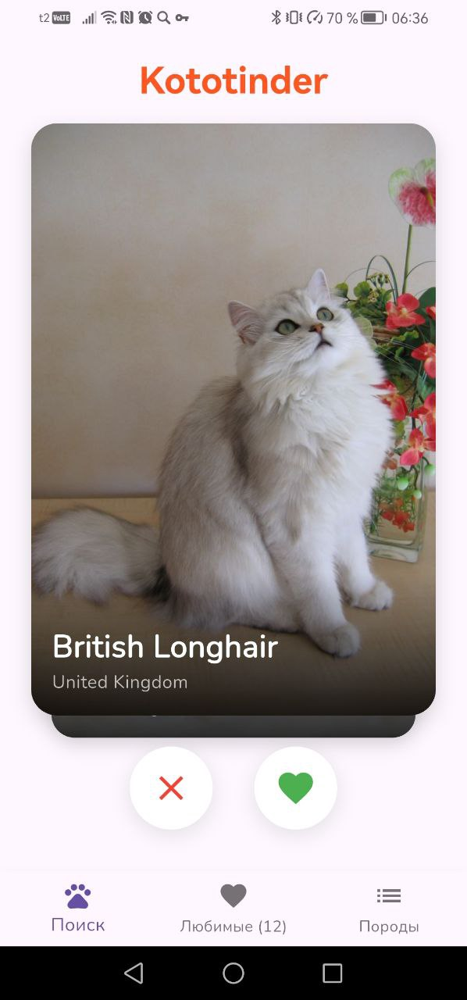
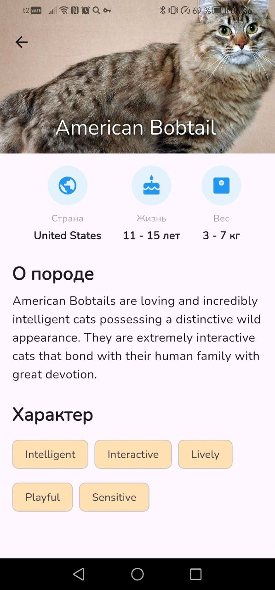
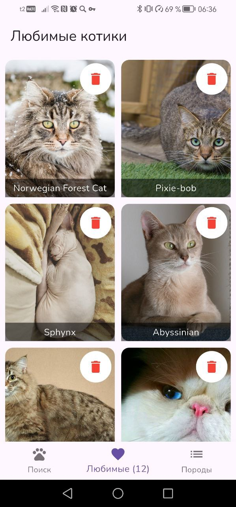
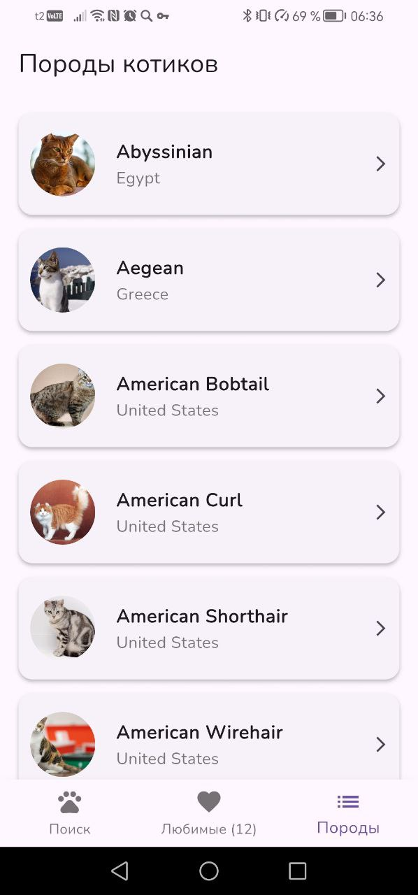

# Kototinder 🐱🔥

Приложение для просмотра и оценки котиков.

Выполнено в рамках Домашней работы №1.

Работу выполнил: Кажкаримов Асхат. 

## Функционал
- **Свайпы:** Механика лайк/дизлайк с анимацией карточек (Appinio Swiper).
- **Мэтчи:** Сохранение любимых котиков в "Избранное". Удаление котиков из любимых.
- **Инфо:** Детальный экран с характеристиками породы (Страна, Вес, Продолжительность жизни, Темперамент).
- **Список пород:** Отдельный каталог всех пород с поиском и аватарками.
- **API:** Работа с TheCatAPI (поддержка ключей, обработка ошибок).

## Техническая часть
- **Стек:** Flutter, Dart.
- **Сеть:** Dio (с интерцепторами и тайм-аутами).
- **Кэширование:** CachedNetworkImage для картинок.
- **Архитектура:** Разделение на слои (Screens, Models, Services).
- **Визуал:** Кастомная иконка, шрифт Nunito, адаптивная верстка, Material 3.
- **Code Quality:** Линтер настроен, код отформатирован (`flutter analyze` проходит без ошибок).

## Скриншоты
| Главный экран | Детали | Избранное | Список пород |
|---|---|---|---|
|  |  |  |  |

## Скачать APK
[Скачать актуальную версию (app-release.apk)](https://github.com/justcipunz/kototinder/releases/tag/1.0)
